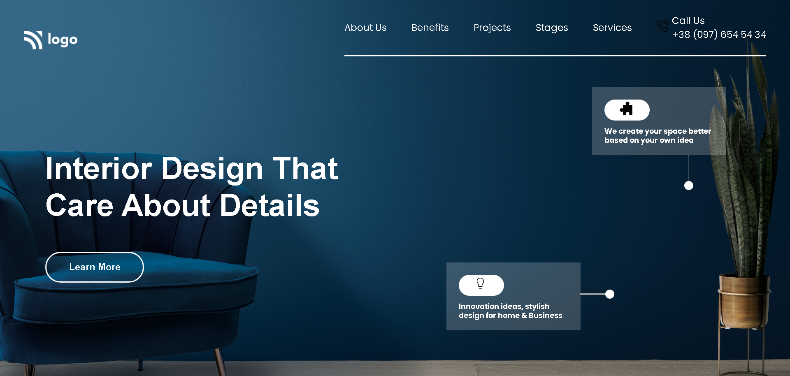
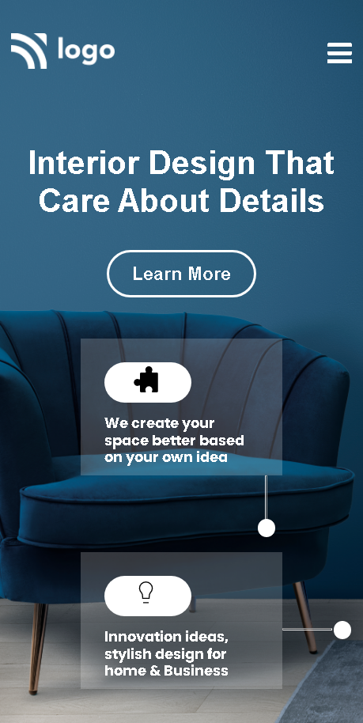

#  Interior Design Landing Page &nbsp;  &nbsp; 

## Skills acquired 👨‍💻
- How to use the css position property to aign the elements at specific position.
- How to use the border properties for styleing the element.

## Time taken to complete the project ⏲️

12hrs

## Screenshot &nbsp; 

 
 

 
 
